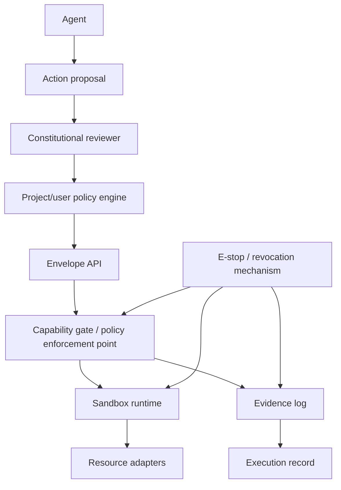

# Constitutional Sandbox Envelope Design Proposal

## Summary

The constitutional sandbox envelope is a proposed layered safety
architecture for future autonomous and semi-autonomous LRH agent
execution. It separates what an agent may *suggest* from what LRH will
actually *do* on the host machine, in the repository, through the shell,
against GitHub, with secrets, in cloud services, or through MCP tools.

Core rule:

> Agents may propose arbitrary actions. Agents may execute only
> authorized capabilities. Every capability invocation is policy-checked,
> sandboxed, logged, and interruptible.

The proposal is intended to support future `lrh run --execute` behavior,
agent adapters, MCP interactions, external tool access, and higher-
autonomy work item execution while preserving LRH's repository-centered,
evidence-backed control-plane model. The envelope should make authority
explicit, reviewable, and revocable rather than relying on unrestricted
ambient access to the machine running LRH.

This PR is documentation-focused. It does not implement the envelope or
change current LRH runtime behavior.

## Motivation

AI coding agents can be useful assistants, but they are also capable of
large, fast, and surprising side effects. An agent may accidentally or
incorrectly delete files, modify broad areas of a repository, expose
secrets, invoke unsafe tools, act outside the current work item, or keep
spending tokens and subprocess time after its useful work is complete.

A wrapper such as a safer `srm` command is not enough if the agent can
bypass that wrapper with raw `rm`, a Python script, a different shell
path, a package manager hook, or an MCP filesystem tool. Safety must be
attached to the authority boundary itself, not only to preferred
commands.

LRH therefore needs a security-by-design foundation before adding higher-
autonomy execution. The foundation should complement, not replace,
existing guardrails, tests, pull request review, GitHub Actions,
execution records, work item readiness, and human oversight. The goal is
not to make autonomous execution risk-free. The goal is to make every
material authority explicit, policy-bounded, auditable, and interruptible.

## Security framing

The constitutional sandbox envelope addresses risks that arise when an
agent has too much ambient authority or when a human cannot reconstruct
what authority was exercised. Threat categories include:

- destructive filesystem actions, including broad edits and deletes;
- unrestricted shell execution, including command injection and hidden
  helper scripts;
- prompt injection that attempts to override project guardrails or leak
  data;
- excessive agency where an agent expands the task beyond the current
  work item readiness and scope;
- secret exfiltration from environment variables, dotfiles, credential
  stores, logs, or configuration files;
- unsafe network access, including unreviewed uploads and arbitrary
  downloads;
- unsafe MCP/tool access where a model can reach filesystem, browser,
  database, robotics, cloud, or messaging capabilities through a tool
  server;
- supply-chain compromise through dependency installation, package
  scripts, vendored code, or unpinned downloads;
- runaway loops, uncontrolled cost, or unbounded subprocesses; and
- accidental scope creep across unrelated files, repositories, projects,
  work items, or deployment environments.

In LRH terms, these risks belong largely to the Consequences Plane, but
they cross the Execution Plane and Truth Plane as soon as an agent can
take actions. The envelope should become a guardrail around `lrh run`,
agent adapters, validation commands, MCP environments, and resource
adapters. Each allowed action should produce evidence that can support
execution records, PR review, future status interpretation, and security
review.

## Relationship to existing LRH architecture

LRH's control-plane model separates project intent, execution state,
truth, and consequences:

- **Intent Plane:** principles, goals, and roadmap direction.
- **Execution Plane:** current focus, work items, proposed actions, and
  bounded implementation steps.
- **Truth Plane:** evidence, validation results, status, and reviewable
  facts about what happened.
- **Consequences Plane:** safety, cost, optics, approvals, release risk,
  and other effects outside the code diff itself.

The sandbox envelope belongs primarily in the Consequences Plane and the
Execution Plane:

- it constrains which proposed actions can be executed;
- it records evidence for executed, denied, and interrupted actions;
- it should be driven by project guardrails, work item policy, runtime
  approval mode, and explicit user authorization; and
- it should feed the Truth Plane with structured facts rather than
  optimistic summaries.

The proposal deliberately avoids jumping straight to deep multi-agent
orchestration, broad MCP integration, or production cloud automation. It
defines a phased path that can start with filesystem and Git policy
checks around a small `lrh run` surface, then grow only as the control-
plane slice and evidence model mature.

## Architecture

The envelope is a layered authority boundary. Agents communicate intent;
LRH owns policy decisions, sandboxing, resource access, evidence, and
revocation.



Layer responsibilities:

- **Agent:** generates plans, edits, command requests, tool requests, and
  explanations. It does not receive raw ambient authority over the host.
- **Action proposal:** a structured request describing the desired
  operation, target resources, rationale, expected result, and work item
  context.
- **Constitutional reviewer:** classifies semantic risk, detects likely
  out-of-scope behavior, and recommends `allow`, `deny`, `ask_human`,
  `out_of_scope`, `dangerous`, or `uncertain`.
- **Project/user policy engine:** resolves project guardrails, repository
  policy, work item policy, runtime flags, and user approvals into an
  effective policy for the run.
- **Envelope API:** exposes narrow capabilities such as safe file patching
  and known validation commands instead of raw shell or filesystem access.
- **Capability gate / policy enforcement point:** performs hard checks,
  denies or pauses disallowed requests, requires approvals, and is the
  only route from agent intent to side effects.
- **Sandbox runtime:** contains execution in a worktree, temp clone,
  container, VM, or remote runner so failures and unexpected writes are
  limited.
- **Resource adapters:** implement safe access to local files, Git,
  GitHub, MCP tools, cloud APIs, package managers, and future external
  systems under the capability policy.
- **Evidence log:** writes structured records for every capability
  decision and result, including denied and interrupted requests.
- **Execution record:** summarizes the run, validation, commits, PRs,
  approvals, limitations, and links to evidence.
- **E-stop / revocation mechanism:** stops new capability calls,
  terminates active work where feasible, records the stop, and requires
  explicit human action before resuming.

The layers have distinct jobs. Constitutional review advises or
classifies semantic risk. Capability policy enforces hard rules.
Sandboxing contains damage. Evidence records what happened. Humans retain
final authority for high-risk actions.

## Capability envelope

The core design move is capability-oriented execution. Agents should not
receive a raw shell, host filesystem, unrestricted GitHub token, arbitrary
network access, cloud credentials, secrets, or direct MCP tool handles by
default. LRH should expose narrow operations whose inputs and side effects
can be checked.

Illustrative capabilities include:

- `safe_read(path)`
- `safe_write_patch(path, patch)`
- `safe_create_file(path, contents)`
- `safe_delete(path)`
- `safe_list_dir(path)`
- `safe_git_status()`
- `safe_git_diff()`
- `safe_run_validation(command_id)`
- `safe_create_branch(name)`
- `safe_commit_changes(message)`
- `safe_open_pull_request(title, body)`
- `safe_comment_on_pr(pr_url, body)`

The exact API may change, and some capabilities may remain human-only or
backend-specific. The important design principle is that execution flows
through capability-limited operations with policy-aware arguments,
structured results, and evidence hooks.

## Dangerous capabilities and approval gates

Some actions should be unavailable by default, denied outright, or gated
behind explicit human approval. Examples include:

- recursive delete or broad glob delete;
- deletion above the workspace root;
- writes outside allowed paths;
- symlink escapes and path traversal;
- reading secrets, credentials, tokens, private keys, or sensitive local
  configuration;
- arbitrary network requests;
- dependency installation or package-manager script execution;
- modifying CI, deployment, release, or security-sensitive workflows;
- package publishing;
- deployment;
- force push;
- branch deletion;
- cloud API calls;
- external MCP calls; and
- access to production, customer, robot, lab, or otherwise privileged
  systems.

The default posture should be deny or ask. A project can narrow allowed
capabilities for a work item, but lower-level runtime requests should not
expand authority beyond higher-level guardrails.

## Policy model

The policy model should be layered, explicit, and conservative. A future
policy file or work item section might look like this:

```yaml
sandbox_policy:
  filesystem: workspace_write
  network: disabled
  secrets: disabled
  shell: validation_commands_only
  approval_mode: on_request

work_item_policy:
  allowed_paths:
    - src/lrh/
    - tests/
  disallowed_paths:
    - .env
    - secrets/
    - .github/workflows/deploy.yml

capability_policy:
  safe_delete: ask
  safe_write_patch: allow
  safe_run_validation: allow_if_command_id_known
  network_request: deny
  read_secret: deny
```

Likely precedence, from broadest authority boundary to narrowest request:

1. global project principles and guardrails;
2. repository security policy or adopted design policy;
3. work item policy;
4. runtime invocation policy; and
5. agent request.

Lower layers may narrow authority but not expand beyond higher-level
constraints. For example, a runtime flag may make a run read-only even if
project policy permits writes, but an agent request cannot turn network
access on when the project policy disables it.

Policy decisions should be machine-readable and evidence-backed. A deny
should explain which rule was violated. An ask should name the approving
human, approval timestamp, requested capability, argument summary, and
bounded duration of the approval.

## Sandbox runtime options

Several runtime isolation strategies are plausible. They differ in cost,
portability, and containment strength.

### Temp clone or Git worktree

Pros:

- simple MVP path;
- fast to create and inspect;
- keeps workflow centered on Git diffs;
- easy to throw away after a failed run; and
- works on common developer machines and CI runners.

Cons:

- weak OS-level isolation;
- still shares host user privileges unless combined with other controls;
- must guard symlinks, absolute paths, and subprocess working directories;
  and
- does not by itself prevent network use or secret access.

### Docker or rootless Docker

Pros:

- stronger process and filesystem isolation than a worktree alone;
- repeatable runtime images;
- easier network and mount configuration;
- useful for deterministic validation environments.

Cons:

- Docker is not magic;
- mounted volumes, host privileges, daemon access, secrets, network
  policy, and container capabilities can undo the safety boundary;
- rootless behavior varies by platform; and
- local Docker availability is not universal.

### VM or isolated machine

Pros:

- stronger isolation boundary;
- useful for high-risk code, untrusted dependencies, robotics tools, or
  cloud credentials;
- clearer cleanup semantics for whole-machine state.

Cons:

- higher operational cost;
- slower startup;
- more complex artifact transfer and debugging;
- more setup burden for contributors.

### Remote CI or ephemeral runner

Pros:

- clean, auditable, reproducible execution environment;
- integrates with existing CI logs and permissions;
- can enforce repository-level secrets and approval rules.

Cons:

- queue latency;
- cloud cost;
- network and secret policy must still be carefully configured;
- harder local iteration; and
- runner compromise or misconfiguration remains possible.

Recommended MVP sequence:

1. temp clone/worktree for workflow isolation;
2. rootless Docker or equivalent for OS-level isolation; and
3. VM or remote execution later for high-risk workflows.

The first step should be enough to build the policy API, evidence model,
and work item integration without pretending to solve all sandbox escape
risks.

## Evidence and audit logging

Every capability request should be able to produce structured evidence,
including denied and interrupted requests. A future log entry might use a
shape like this:

```yaml
timestamp:
run_id:
work_item_id:
actor:
capability:
arguments:
policy_decision:
approval:
result:
files_changed:
hash_before:
hash_after:
stdout_path:
stderr_path:
```

The evidence model supports:

- execution records that say what happened rather than what the agent
  intended;
- PR review, because reviewers can inspect capability decisions alongside
  the diff;
- debugging failed or surprising runs;
- security review of denied, approved, and high-risk actions; and
- future status interpretation grounded in validation, logs, metrics,
  screenshots, reports, review notes, or other evidence.

Evidence should avoid leaking secrets. Argument summaries may need
redaction, hashing, or path-only representations for sensitive inputs.
Logs should distinguish between agent text, policy decisions, command
stdout/stderr, file diffs, and human approvals.

## E-stop / revocation

The envelope should include an emergency stop and revocation mechanism.
A future command could be shaped like `lrh run stop <run-id>` or an
equivalent local/remote control. The mechanism should:

- deny new capability calls for the run;
- terminate active subprocesses where feasible;
- revoke temporary approvals and tokens where feasible;
- mark the run as stopped;
- require explicit human action to resume or clone a follow-up run; and
- record the stop in evidence and execution records.

E-stop cannot guarantee instant termination in every backend, but it
should be part of the contract between the agent adapter, capability
policy layer, sandbox runtime, and evidence log.

## Constitutional reviewer

The constitutional reviewer is a semantic policy layer. It evaluates
proposed actions against LRH guardrails, project principles, work item
scope, safety posture, and possibly future project constitutions. Its
classification vocabulary should include:

- `allow`
- `deny`
- `ask_human`
- `out_of_scope`
- `dangerous`
- `uncertain`

This reviewer should not be the only guardrail. Model-based review can be
wrong, incomplete, prompt-injected, or overconfident. It is a belt-and-
suspenders semantic check layered over hard enforcement, sandbox
containment, evidence, and human approval for high-risk actions.

Useful reviewer responsibilities include detecting requests that are
technically permitted but semantically suspicious: editing unrelated
files, broadening scope without work item readiness, attempting to read
secrets, modifying deployment workflows during an unrelated docs task, or
calling external tools that are irrelevant to the stated objective.

## MVP implementation path

A possible staged path is:

1. Document a capability request/result model.
2. Implement hard filesystem and Git policy checks.
3. Add safe read, write, create, delete, and patch operations.
4. Add structured evidence logging for capability calls.
5. Add run-level e-stop state.
6. Wire the envelope into `lrh run --dry-run` or assisted execution.
7. Add a temp-clone or Git-worktree sandbox runtime.
8. Add a Docker, rootless Docker, or equivalent sandbox runtime.
9. Add the constitutional reviewer as semantic advice.
10. Add GitHub, MCP, cloud, package-manager, and other resource adapters.

The first PR for this task only adds the design proposal and discoverable
proposal-set metadata. Implementation should remain incremental and
control-plane-first.

## Pros and cons

Pros:

- provides defense in depth;
- solves the `srm` bypass problem by moving safety to the authority
  boundary;
- supports least privilege;
- remains agent-agnostic;
- aligns with LRH's evidence-first philosophy;
- enables safer future autonomy;
- supports eventual multi-agent and MCP expansion without starting there;
  and
- makes approvals, denials, and interruptions reviewable.

Cons:

- adds engineering complexity;
- may create friction for agents and users;
- introduces policy design and maintenance burden;
- can create false confidence if the sandbox is oversold;
- depends on careful sandbox configuration;
- may have cross-platform challenges;
- can generate substantial evidence and review volume; and
- may require adapter-specific behavior for GitHub, MCP, cloud, and
  package-manager integrations.

## Open questions

Future design and implementation work should answer:

- What is the minimum safe shell subset, if any?
- Should capability policy be expressed in YAML, Python, or a dedicated
  policy language?
- How should approvals be represented in execution records?
- How should envelope policy compose with work item readiness?
- What should the first true sandbox backend be?
- How should LRH handle agent requests that require network access or
  package installation?
- How should this integrate with GitHub Actions, Codex Cloud, Claude
  Code, Aider, and future MCP servers?
- How should evidence logs redact sensitive arguments without becoming
  useless for review?
- How should policies distinguish local development repositories from
  privileged production, robotics, or cloud environments?

## Non-goals for this proposal

This proposal does not immediately:

- implement the full envelope;
- replace human review;
- guarantee security against all sandbox escapes;
- implement production access;
- grant agents unrestricted shell access;
- replace CI, tests, lint, or PR review;
- solve all AI alignment problems;
- require deep MCP integration in the first slice; or
- require multi-agent orchestration before the control-plane and
  validation path are mature.

## Recommended design principle

> Constitutional review advises. Capability policy enforces. Sandboxing
> contains. Evidence records. Humans retain final authority.
