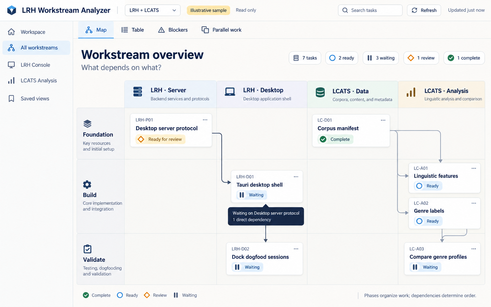
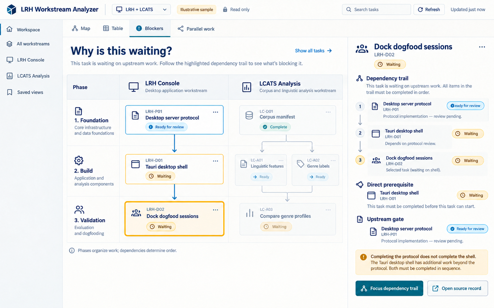
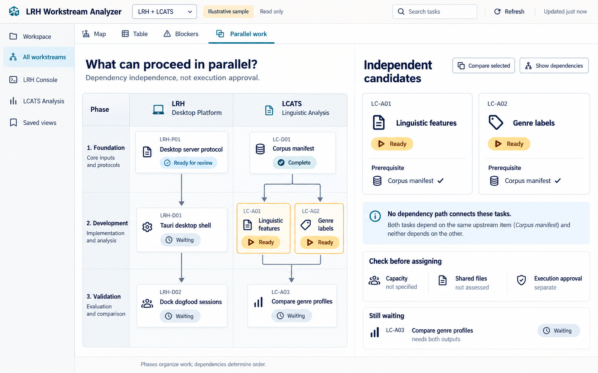
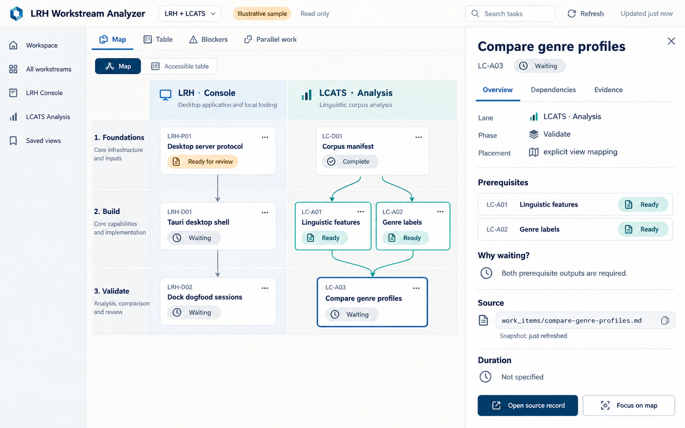

# Dependency analyzer mockups

Four visual concepts generated with OpenAI image generation on 2026-09-26 for
[LRH Console: Local Dogfood and Dependency Maps](../00_proposal.md). These preserve
the final images discussed in the design conversation, including the refined
blocker and detail views with task-creation placeholders removed.

These are illustrative L1 web-interface concepts, not screenshots of implemented
features, live LRH/LCATS status, acceptance evidence, or authorization to implement.
Task IDs, source paths, states, and freshness labels in the images are examples.
The proposal remains authoritative for semantics and scope.

## Views

| Mockup | Question answered | Main interaction |
| --- | --- | --- |
| [01: Lane-and-phase overview](01-lane-phase-overview.png) | What depends on what? | Scan lane columns and phase rows; inspect dependency arrows and hover summaries. |
| [02: Blocker trace](02-blocker-trace.png) | Why is this waiting? | Select a task to highlight direct prerequisites and upstream blockers. |
| [03: Parallel work](03-parallel-work.png) | What could proceed independently? | Compare structurally independent tasks while exposing unassessed resources and approval. |
| [04: Task detail drawer](04-task-detail-drawer.png) | What supports this task's state? | Inspect placement, prerequisites, source records, and evidence without leaving the map. |

## Recommended progression

Start with the overview and the task drawer on card selection. Add blocker tracing
next, then the parallel-work view once dependency semantics are reliable. This is
a UI recommendation within L1, not a change to the protocol → desktop → dependency
map implementation sequence or the workstream's evidence gates.

## Interpretation and implementation notes

- Lanes are vertical; phases are horizontal organizational rows, not time estimates
  or blanket execution barriers. Arrow direction is prerequisite → dependent.
- The overview uses four conceptual lanes; the other sketches use two broader
  groupings. Define explicit view mappings before implementing either arrangement;
  do not infer canonical placement from these pictures.
- Standardize phase names, status labels, icons, and colors across views. The
  generated concepts vary these treatments and are not a finished component spec.
- A card's "Ready" label must distinguish dependency satisfaction, LRH readiness,
  and execution authorization. Dependency independence alone does not establish
  available people, compute, compatible file access, or permission to execute.
- Preserve distinctions between dependencies, explicit blockers, and review gates.
  Render actual source relationships rather than copying decorative arrow routing;
  the overview has a redundant incoming connector to Linguistic features.
- The current read-only scope includes inspection, filtering, source navigation,
  and refresh. No task creation, project mutation, or agent execution is implied.
- Keyboard/click/touch access and an equivalent accessible table are required;
  hover is supplemental. Use text, icons, and line styles alongside color.
- Show unknown duration, ambiguous/unplaced tasks, missing references, cycles,
  hidden dependencies, and stale/failed refreshes explicitly. These small happy-path
  sketches do not cover the complete state model.
- Header marks are placeholders, not the final LRH app icon or branding decision.

## Gallery

### 01 — Lane-and-phase overview

### 02 — Blocker trace

### 03 — Parallel work

### 04 — Task detail drawer

