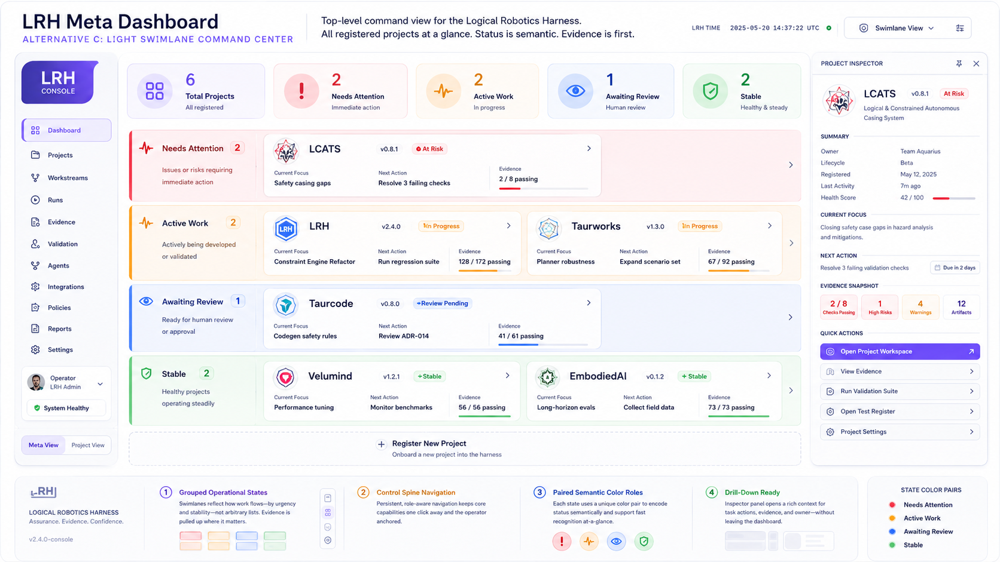
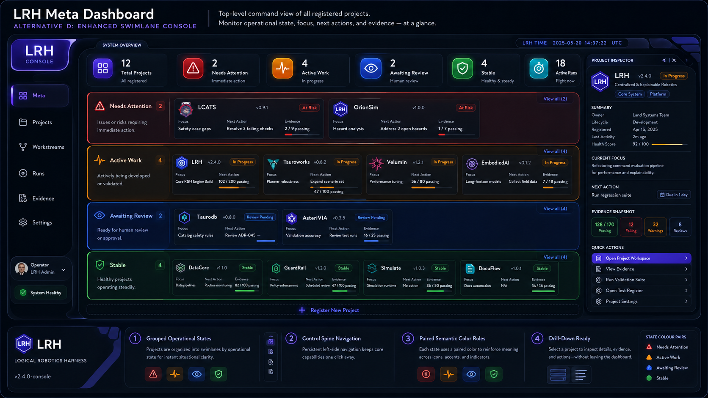

# LRH Console Visual Language Design Proposal

## Summary

LRH should adopt **Alternative D: Enhanced Swimlane Console** as the preferred visual language
direction for future `lrh serve` dashboard work. The direction combines a friendly, readable,
pastel, swoopy console shape language with stronger operational swimlane semantics so that project
state can be understood at a glance without losing LRH's evidence-backed discipline.

This is a design proposal, not an implementation PR. It records the intended visual language,
information architecture, reusable dashboard patterns, theme direction, and guardrails for later UI
work after the safe-default `lrh serve` MVP stabilizes.

## Scope and non-goals

In scope:

- visual language for future LRH Console and `lrh serve` dashboard surfaces;
- information architecture for meta, project, workstream, work item, run, and evidence views;
- reusable dashboard patterns and components;
- semantic status vocabulary for operational state;
- light and dark theme direction;
- accessibility constraints; and
- implementation guidance for later work.

Out of scope:

- changing current `lrh serve` implementation behavior;
- choosing a frontend framework;
- adding mutating UI actions;
- implementing pixel-perfect generated mockups; or
- expanding the safe-default MVP acceptance criteria.

**This proposal defines the visual language and UX structure for future `lrh serve` dashboards. It
does not expand the current safe-default MVP implementation scope.**

## Mockup References

### Light mode



### Dark mode



## Motivation

LRH's control plane intentionally carries human-readable and machine-interpretable information:
principles, goals, roadmaps, focus, work items, evidence, execution records, and status. As a project
registry grows, users need to understand where attention is required, what is actively moving, what
is waiting for review, and what is stable without reading every source document first.

A top-level operational swimlane meta dashboard is stronger than a generic grid because it encodes
state spatially. Instead of presenting unrelated project cards in a uniform list, the swimlane view
groups projects by operational meaning, lets users scan lanes from highest-risk to most-stable, and
supports comparisons among projects that need the same type of action.

This fits LRH's evidence-backed, human-auditable, machine-interpretable model. The UI should not
simply decorate status claims. It should show why the claim is credible: validation output, evidence
counts, source artifacts, run states, open blockers, or an explicit unknown/unavailable state when
truth is not yet established.

## Chosen visual direction

The chosen direction is the light/dark pair of **Alternative D: Enhanced Swimlane Console**.

The console should feel friendly and operational, not literal LCARS. It can borrow the readable,
pastel, swoopy, panel-based feel from the earlier light concept while using the clearer grouping,
state semantics, and lane hierarchy of the swimlane command-center concept.

The light and dark themes should share the same information architecture and semantic token model.
Only token values should change between themes; component roles, layout semantics, and status
vocabulary should remain consistent.

Operational grouping should use multiple redundant cues:

- full-width lane tinting or shading;
- clear lane borders;
- left accent rails;
- visible lane labels;
- icons paired with labels;
- project cards nested inside their current operational lane; and
- inspector/detail affordances that preserve the lane context.

Generated mockup images are illustrative references. They are not pixel-perfect implementation
requirements and should not force a particular frontend technology, exact color value, or exact
component geometry.

## Conceptual model

Future dashboards should preserve LRH's conceptual stack:

```text
Meta → Project → Workstream → Work Item → Run → Evidence
```

Deeper dashboards should also keep the following LRH concepts visible:

- **Intent** — principles, goals, roadmap, current focus, work item scope, and acceptance criteria.
- **Execution** — prompt, agent or human action, run packet, commands, pull request, and review loop.
- **Truth** — validation results, source artifacts, evidence notes, logs, screenshots, and reports.
- **Consequences** — landed changes, failed runs, supersession, reversions, blockers, and follow-up
  work.

State claims should be evidence-first. A card that says a project is stable, blocked, or awaiting
review should be backed by validation results, evidence counts, artifact links, run status, review
state, or an explicit unknown/unavailable state.

## Information architecture

### Meta dashboard

The meta dashboard should show all registered projects in operational swimlanes. It is the place to
answer: Which projects need attention? Which are actively moving? Which are awaiting review? Which
are stable? Which are blocked or unknown?

### Project dashboard

A project dashboard should expose the current focus, workstreams, work items, evidence, validation
summary, and status rollup for one project. It should make the project-control source documents easy
to reach.

### Workstream dashboard

A workstream dashboard should group related work items by lifecycle stage or operational lane. It
should show what is ready, active, blocked, reviewing, resolved, or waiting for evidence.

### Work item dashboard

A work item dashboard should show acceptance criteria, required changes, validation commands,
evidence chain, execution records, and blockers. It should make it clear whether a work item is ready
for execution, in execution, or waiting for human decision.

### Run / Huge Loop dashboard

A run or Huge Loop dashboard should show a timeline such as:

```text
prompt → agent → PR → review → fix → landed/failed/superseded
```

The timeline should expose where the loop currently waits and what evidence supports each state
transition.

### Execution promise view

An execution promise view should make a bounded pending or completed execution auditable. It should
show the prompt, agent/system identity when available, start time, wait state, target report, and
result/evidence.

## Core UI patterns and components

Future LRH Console work should prefer reusable patterns over one-off templates:

- **App shell** — persistent page frame, navigation, project identity, theme control, and safe-default
  affordances.
- **Control spine** — compact navigation through meta, project, workstream, work item, run, evidence,
  and source views.
- **System overview ribbon** — small top-level summary of project count, validation state, active
  work, and unknown/unavailable data.
- **Operational swimlanes** — full-width lane groups for operational status.
- **Lane header** — lane label, icon, count, explanation, and evidence freshness.
- **Project card** — concise project state, current focus, validation summary, work counts, evidence
  hints, and source links.
- **Project inspector** — detail panel or page that keeps source artifacts and current operational
  context visible.
- **Status badge** — icon, text, color, and shape/border cue for operational or lifecycle state.
- **Evidence chip** — compact evidence count or artifact indicator with link to source evidence.
- **Validation summary** — pass/fail/warning/unknown command summary with timestamp and source link.
- **Guardrail callout** — visible safe-default, read-only, mutation, or unknown-state warning.
- **Quick action button** — explicitly safe action such as copy, open source, preview prompt, or view
  report; unsafe or unsupported actions must not masquerade as quick actions.
- **Loop timeline** — ordered run/review/fix/land/fail/supersede history with evidence links.
- **Execution promise card** — bounded execution summary showing prompt, agent/system, wait state,
  expected report, and result evidence.
- **Source artifact link** — direct path or route back to the Markdown, report, log, or artifact that
  grounds the displayed claim.
- **Theme toggle** — light/dark control that preserves semantic meaning across themes.

## Semantic status vocabulary

The meta dashboard should distinguish operational state from lifecycle state where necessary. For
example, a proposed work item can still be in an operational **Needs Attention** lane if it is
blocked, stale, or missing evidence.

Recommended operational status vocabulary:

- **Needs Attention** — a project or item requires human review, repair, or decision.
- **Active Work** — work is actively being planned, implemented, validated, or revised.
- **Awaiting Review** — work is ready for human, CI, PR, or policy review.
- **Stable** — current state is validated or otherwise supported by recent evidence.
- **Blocked** — forward progress is stopped by a declared blocker, dependency, or missing authority.
- **Unknown / unavailable** — LRH cannot currently establish the state from available control-plane
  data or evidence.

Status must never be conveyed by color alone. Use icon + text + color + position/border cues so the
meaning remains available for users with color-vision differences, low-contrast conditions, screen
readers, or monochrome output.

## Theme and token model

Future implementation should use semantic tokens rather than hard-coded colors. Token naming can be
finalized later, but the model should include categories such as:

- `color.surface.*`
- `color.text.*`
- `color.border.*`
- `color.focus.*`
- `color.status.*`
- `color.plane.*`
- `color.action.*`
- `space.*`
- `radius.*`
- `font.*`
- `shadow.*`
- `motion.*`

Light/dark parity is required: both themes should use the same page structure, component semantics,
state vocabulary, and evidence model. Theme differences should be represented by token values, not by
separate UI concepts.

Operational status tokens should be separate from LRH control-plane tokens. For example,
`color.status.blocked.*` and `color.status.stable.*` describe operational state, while future tokens
for **intent**, **execution**, **truth**, and **consequences** should describe LRH's model concepts
across deeper dashboards.

## Accessibility requirements

Future LRH Console work should meet these accessibility requirements from the first implementation
slice:

- Do not convey state by color alone.
- Use icon + text + color + shape/position/border for state.
- Preserve readable contrast in both light and dark themes.
- Provide visible keyboard focus states.
- Keep controls labeled by default; do not rely on mystery glyphs.
- Ensure graph or visual-heavy views have textual, list, or table equivalents where needed.
- Respect reduced-motion preferences when motion is introduced.

## Safe-default `lrh serve` constraints

The visual language must reinforce, not weaken, the safe-default boundary:

- `lrh serve` is read-only by default.
- Quick actions must not imply unsafe or unsupported mutations.
- Mutating actions, if added later, must be explicit, bounded, and guardrailed.
- No decorative control should hide a dangerous action.
- The current safe-default MVP should remain focused on serving correct project-control views safely.

## Implementation guidance for later work

This proposal does not choose a frontend framework. Later implementation should remain free to use
static HTML/templates, progressive enhancement, or a framework if a future PR justifies the choice.

A practical first implementation slice would probably include:

1. a CSS token file;
2. light and dark theme token values;
3. a style specimen route or page; and
4. one read-only meta dashboard view using operational swimlanes.

Early work may begin with package-owned static/templates and CSS tokens. As implementation matures,
use view models rather than direct ad hoc template dictionaries so that dashboard rendering remains
stable, testable, and reusable.

Do not hard-code LRH repository-specific project names or paths. The dashboard must remain reusable
for client projects that have their own `project/` control directories and potentially different
project registries.

## Open questions

- Exact token names and final color values.
- Icon source.
- Typography/font stack.
- Asset storage convention.
- Whether theme preference persists locally.
- Large project registry scaling: filtering, search, collapsed lanes, and table fallback.
- Inspector behavior: side panel, drawer, or full detail page at smaller breakpoints.

## Mockup assets

The selected light and dark Alternative D mockups are expected to be added manually after this design
proposal lands. Suggested filenames are:

- `assets/alternative_d_enhanced_swimlane_console_light.png`
- `assets/alternative_d_enhanced_swimlane_console_dark.png`

If those files are present, they should be treated as illustrative references for direction,
semantics, and mood. They are not pixel-perfect implementation requirements.

See [`assets/README.md`](assets/README.md) for the placeholder asset convention.

## References / links

- Safe-default `lrh serve` work item:
  [`project/work_items/resolved/WI-LRH-SERVE-SAFE-DEFAULT-MVP.md`](../../../../work_items/resolved/WI-LRH-SERVE-SAFE-DEFAULT-MVP.md)
- Meta control plane MVP spec:
  [`project/design/meta_control_plane_mvp_spec.md`](../../../meta_control_plane_mvp_spec.md)
- Design proposal index:
  [`project/design/proposals/README.md`](../../README.md)
