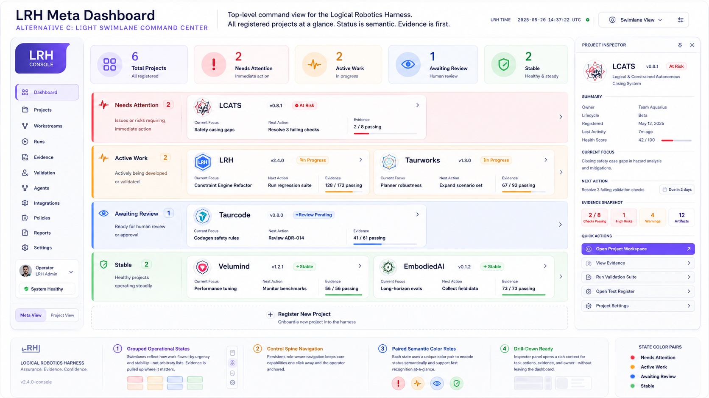
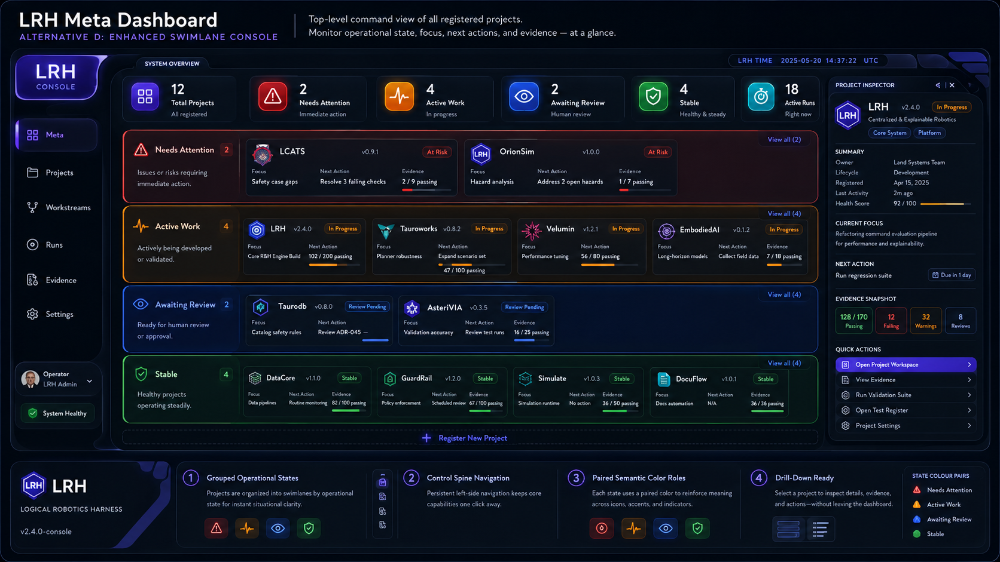

# LRH Console Visual Language Design Proposal

## Summary

LRH should adopt **Alternative D: Enhanced Swimlane Console** as the preferred visual language
direction for future `lrh serve` dashboard work. The direction combines a friendly, readable,
pastel, swoopy console shape language with stronger operational swimlane semantics so that project
state can be understood at a glance without losing LRH's evidence-backed discipline.

This is a design proposal, not an implementation PR. It records the intended visual language,
information architecture, reusable dashboard patterns, theme direction, and guardrails for later UI
work after the safe-default `lrh serve` MVP stabilizes.

**Revision 2 (2026-10-07)** extends the proposal from the meta dashboard to the whole LRH Console:

- the multi-project statusboard;
- the L1 dependency map from
  [`PROP-LRH-CONSOLE-LOCAL-DOGFOOD`](../lrh-console-local-dogfood/00_proposal.md);
- the app frame shared by the desktop app and the browser.

It records the owner's decisions on the design-language questions in
[Revision 2 decisions](#revision-2-decisions-2026-10-07). Where those decisions refine earlier
sections, the decisions section governs. Earlier sections keep their original wording, with short
"Revision 2" pointers where a term changed, so the first revision stays readable. The Open
questions, Mockup assets, and implementation-guidance sections were updated in place.

## Scope and non-goals

In scope:

- visual language for future LRH Console and `lrh serve` dashboard surfaces;
- information architecture for meta, project, workstream, work item, run, and evidence views;
- reusable dashboard patterns and components;
- semantic status vocabulary for operational state;
- light and dark theme direction;
- accessibility constraints; and
- implementation guidance for later work.

Out of scope:

- changing current `lrh serve` implementation behavior;
- choosing a frontend framework;
- adding mutating UI actions;
- implementing pixel-perfect generated mockups; or
- expanding the safe-default MVP acceptance criteria.

**This proposal defines the visual language and UX structure for future `lrh serve` dashboards. It
does not expand the current safe-default MVP implementation scope.**

## Mockup References

### Light mode



### Dark mode



## Motivation

LRH's control plane intentionally carries human-readable and machine-interpretable information:
principles, goals, roadmaps, focus, work items, evidence, execution records, and status. As a project
registry grows, users need to understand where attention is required, what is actively moving, what
is waiting for review, and what is stable without reading every source document first.

A top-level operational swimlane meta dashboard is stronger than a generic grid because it encodes
state spatially. Instead of presenting unrelated project cards in a uniform list, the swimlane view
groups projects by operational meaning, lets users scan lanes from highest-risk to most-stable, and
supports comparisons among projects that need the same type of action.

This fits LRH's evidence-backed, human-auditable, machine-interpretable model. The UI should not
simply decorate status claims. It should show why the claim is credible: validation output, evidence
counts, source artifacts, run states, open blockers, or an explicit unknown/unavailable state when
truth is not yet established.

## Chosen visual direction

The chosen direction is the light/dark pair of **Alternative D: Enhanced Swimlane Console**.

The console should feel friendly and operational, not literal LCARS. It can borrow the readable,
pastel, swoopy, panel-based feel from the earlier light concept while using the clearer grouping,
state semantics, and lane hierarchy of the swimlane command-center concept.

The light and dark themes should share the same information architecture and semantic token model.
Only token values should change between themes; component roles, layout semantics, and status
vocabulary should remain consistent.

Operational grouping should use multiple redundant cues:

- full-width lane tinting or shading;
- clear lane borders;
- left accent rails;
- visible lane labels;
- icons paired with labels;
- project cards nested inside their current operational lane; and
- inspector/detail affordances that preserve the lane context.

Generated mockup images are illustrative references. They are not pixel-perfect implementation
requirements and should not force a particular frontend technology, exact color value, or exact
component geometry.

## Conceptual model

Future dashboards should preserve LRH's conceptual stack:

```text
Meta → Project → Workstream → Work Item → Run → Evidence
```

Deeper dashboards should also keep the following LRH concepts visible:

- **Intent** — principles, goals, roadmap, current focus, work item scope, and acceptance criteria.
- **Execution** — prompt, agent or human action, run packet, commands, pull request, and review loop.
- **Truth** — validation results, source artifacts, evidence notes, logs, screenshots, and reports.
- **Consequences** — landed changes, failed runs, supersession, reversions, blockers, and follow-up
  work.

State claims should be evidence-first. A card that says a project is stable, blocked, or awaiting
review should be backed by validation results, evidence counts, artifact links, run status, review
state, or an explicit unknown/unavailable state.

## Information architecture

### Meta dashboard

*Revision 2: this view is now the **statusboard**, and its status rows are **bands**. See
[Vocabulary](#vocabulary-q2).*

The meta dashboard should show all registered projects in operational swimlanes. It is the place to
answer: Which projects need attention? Which are actively moving? Which are awaiting review? Which
are stable? Which are blocked or unknown?

### Project dashboard

A project dashboard should expose the current focus, workstreams, work items, evidence, validation
summary, and status rollup for one project. It should make the project-control source documents easy
to reach.

### Workstream dashboard

A workstream dashboard should group related work items by lifecycle stage or operational lane. It
should show what is ready, active, blocked, reviewing, resolved, or waiting for evidence.

### Work item dashboard

A work item dashboard should show acceptance criteria, required changes, validation commands,
evidence chain, execution records, and blockers. It should make it clear whether a work item is ready
for execution, in execution, or waiting for human decision.

### Run / Huge Loop dashboard

A run or Huge Loop dashboard should show a timeline such as:

```text
prompt → agent → PR → review → fix → landed/failed/superseded
```

The timeline should expose where the loop currently waits and what evidence supports each state
transition.

### Execution promise view

An execution promise view should make a bounded pending or completed execution auditable. It should
show the prompt, agent/system identity when available, start time, wait state, target report, and
result/evidence.

## Core UI patterns and components

Future LRH Console work should prefer reusable patterns over one-off templates:

- **App shell** — persistent page frame, navigation, project identity, theme control, and safe-default
  affordances.
- **Control spine** — compact navigation through meta, project, workstream, work item, run, evidence,
  and source views.
- **System overview ribbon** — small top-level summary of project count, validation state, active
  work, and unknown/unavailable data.
- **Operational swimlanes** — full-width lane groups for operational status. *(Revision 2: these
  are statusboard **bands**.)*
- **Lane header** — lane label, icon, count, explanation, and evidence freshness. *(Revision 2: band
  header.)*
- **Project card** — concise project state, current focus, validation summary, work counts, evidence
  hints, and source links.
- **Project inspector** — detail panel or page that keeps source artifacts and current operational
  context visible.
- **Status badge** — icon, text, color, and shape/border cue for operational or lifecycle state.
- **Evidence chip** — compact evidence count or artifact indicator with link to source evidence.
- **Validation summary** — pass/fail/warning/unknown command summary with timestamp and source link.
- **Guardrail callout** — visible safe-default, read-only, mutation, or unknown-state warning.
- **Quick action button** — explicitly safe action such as copy, open source, preview prompt, or view
  report; unsafe or unsupported actions must not masquerade as quick actions.
- **Loop timeline** — ordered run/review/fix/land/fail/supersede history with evidence links.
- **Execution promise card** — bounded execution summary showing prompt, agent/system, wait state,
  expected report, and result evidence.
- **Source artifact link** — direct path or route back to the Markdown, report, log, or artifact that
  grounds the displayed claim.
- **Theme toggle** — light/dark control that preserves semantic meaning across themes. *(Revision 2:
  Light, Dark, and System, set outside the page until the interactive mode exists; see
  [Themes](#themes-q5).)*

## Semantic status vocabulary

The meta dashboard should distinguish operational state from lifecycle state where necessary. For
example, a proposed work item can still be in an operational **Needs Attention** lane (Revision 2:
band) if it is
blocked, stale, or missing evidence.

Recommended operational status vocabulary:

- **Needs Attention** — a project or item requires human review, repair, or decision.
- **Active Work** — work is actively being planned, implemented, validated, or revised.
- **Awaiting Review** — work is ready for human, CI, PR, or policy review.
- **Stable** — current state is validated or otherwise supported by recent evidence.
- **Blocked** — forward progress is stopped by a declared blocker, dependency, or missing authority.
- **Unknown / unavailable** — LRH cannot currently establish the state from available control-plane
  data or evidence.

Status must never be conveyed by color alone. Use icon + text + color + position/border cues so the
meaning remains available for users with color-vision differences, low-contrast conditions, screen
readers, or monochrome output.

## Theme and token model

Future implementation should use semantic tokens rather than hard-coded colors. Token naming can be
finalized later, but the model should include categories such as:

- `color.surface.*`
- `color.text.*`
- `color.border.*`
- `color.focus.*`
- `color.status.*`
- `color.plane.*`
- `color.action.*`
- `space.*`
- `radius.*`
- `font.*`
- `shadow.*`
- `motion.*`

Light/dark parity is required: both themes should use the same page structure, component semantics,
state vocabulary, and evidence model. Theme differences should be represented by token values, not by
separate UI concepts.

Operational status tokens should be separate from LRH control-plane tokens. For example,
`color.status.blocked.*` and `color.status.stable.*` describe operational state, while future tokens
for **intent**, **execution**, **truth**, and **consequences** should describe LRH's model concepts
across deeper dashboards.

## Accessibility requirements

Future LRH Console work should meet these accessibility requirements from the first implementation
slice:

- Do not convey state by color alone.
- Use icon + text + color + shape/position/border for state.
- Preserve readable contrast in both light and dark themes.
- Provide visible keyboard focus states.
- Keep controls labeled by default; do not rely on mystery glyphs.
- Ensure graph or visual-heavy views have textual, list, or table equivalents where needed.
- Respect reduced-motion preferences when motion is introduced.

## Safe-default `lrh serve` constraints

The visual language must reinforce, not weaken, the safe-default boundary:

- `lrh serve` is read-only by default.
- Quick actions must not imply unsafe or unsupported mutations.
- Mutating actions, if added later, must be explicit, bounded, and guardrailed.
- No decorative control should hide a dangerous action.
- The current safe-default MVP should remain focused on serving correct project-control views safely.

## Implementation guidance for later work

This proposal does not choose a frontend framework. Later implementation should remain free to use
static HTML/templates, progressive enhancement, or a framework if a future PR justifies the choice.

A practical first implementation slice would probably include:

1. a CSS token file;
2. light and dark theme token values;
3. a style specimen route or page; and
4. one read-only meta dashboard view using operational swimlanes (Revision 2: the banded statusboard).

Revision 2 refines this into the L1 work of `WS-LRH-CONSOLE-LOCAL-DOGFOOD`, one work item per PR:

1. the shared token file and style specimen;
2. theme plumbing (System default, `--theme`, desktop Settings);
3. the app frame in Serve's pages;
4. the dependency-map snapshot and view declaration;
5. the static map renderer with a pluggable layout;
6. the interactive mode, after the static version;
7. the banded statusboard.

These work items are created in a later planning change.

Early work may begin with package-owned static/templates and CSS tokens. As implementation matures,
use view models rather than direct ad hoc template dictionaries so that dashboard rendering remains
stable, testable, and reusable.

Do not hard-code LRH repository-specific project names or paths. The dashboard must remain reusable
for client projects that have their own `project/` control directories and potentially different
project registries.

## UX Review Criteria

Reviewers should use these criteria to evaluate implemented LRH Console and `lrh serve` UX against
the proposed visual language. They are review aids, not a blanket expansion of the safe-default MVP
acceptance criteria. A tranche can be acceptable when it is safe, semantic, evidence-aware, and
compatible with the visual direction even if full Alternative D polish is intentionally deferred.

### Safe-default scope

- Does the implemented UI preserve read-only safe-default behavior unless a separate guardrailed
  action design has landed?
- Do any quick actions clearly distinguish navigation and read-only inspection from mutating
  operations?
- Does the UX avoid implying autonomous execution, agent dispatch, branch mutation, CI repair, merge,
  release, publish, or persistence when the implementation does not safely support it?

### Information architecture

- Does the page structure preserve the intended hierarchy: Meta → Project → Workstream → Work Item →
  Run → Evidence?
- Does the page make the user's current scope clear, including which project, workstream, work item,
  run, or evidence source is being inspected?
- Does the first-level meta view help answer “what needs attention now?” rather than only presenting
  undifferentiated project cards?

### Semantic status

- Are statuses represented with text labels and icons or other redundant cues, not color alone?
- Are operational states distinguished from lifecycle states where needed?
- Are **Unknown** and unavailable states explicit rather than silently inferred, hidden, or displayed
  as optimistic defaults?

### Evidence-first display

- Does each status or health claim expose its evidence basis, validation result, artifact count, run
  status, timestamp, or a clear “unknown/unavailable” marker?
- Does the UI avoid optimistic summaries detached from tests, validation output, logs, reports, review
  notes, screenshots, source artifacts, or declared evidence gaps?
- Can a reviewer trace important claims back to a source artifact or intentionally absent evidence
  marker?

### Swimlane / grouping behavior

- If swimlanes are implemented, are lane memberships visually obvious at a glance?
- Do lane backgrounds, borders, labels, icons, and card placement all reinforce grouping?
- Are lanes deterministic and understandable when empty, sparse, or crowded?
- Does an inspector, detail page, or drill-down preserve enough lane context for the user to know why
  the item appeared in that group?

### Theming

- Are light and dark modes structurally equivalent if both are implemented?
- Are theme values expressed through semantic tokens or equivalent role-based styling rather than
  one-off hard-coded colors?
- Does the interface remain readable in both modes, including status badges, focus indicators, links,
  disabled controls, and evidence chips?

### Accessibility

- Is state not conveyed by color alone?
- Are interactive elements keyboard reachable and visibly focused?
- Are controls labeled by default?
- Are icon-only controls avoided or given accessible names?
- Are visual-heavy views paired with text, list, or table alternatives where appropriate?
- Does the implemented structure remain useful to assistive technologies when decorative visual
  grouping is removed?

### Implementation discipline

- Does the implementation avoid selecting a heavy frontend framework without a separate design
  decision?
- Does it avoid hard-coding LRH-repository-specific project names, paths, or fixture data into reusable
  UI code?
- Are diffs narrow, testable, and scoped to the tranche under review?
- Do templates, classes, view models, routes, and tests use semantic names rather than names tied only
  to current colors or geometry?

## First Implemented `lrh serve` UX Review Checklist

Use this checklist for the first review after the first implemented `lrh serve` tranche lands. The
checklist helps reviewers compare the initial safe-default UX against this visual-language direction
without requiring pixel-perfect Alternative D implementation.

- Does the first page expose a clear page structure, including title, current project/root context,
  primary sections, and safe-default framing?
- Is project/control-plane state represented semantically rather than as anonymous raw data dumps?
- Are statuses textual and redundant, not color-only?
- Are routes, view models, and data shapes compatible with future swimlanes, detail views, and
  evidence drill-downs even if swimlanes are not implemented in the first tranche?
- Is the server read-only and safe by default, with no automatic writes, dispatch, branch mutation, PR
  mutation, merge, release, publish, or unsupported filesystem browsing?
- Are templates, CSS classes, route names, and view-model fields named semantically rather than
  visually, so later token/theme work can change presentation without rewriting meaning?
- Is evidence, validation, readiness, run, or artifact state surfaced where available, or at least not
  obscured when unavailable?
- Does the UI avoid pretending to provide quick actions that are not safely implemented?
- Are mockup references treated as illustrative direction rather than pixel-perfect acceptance
  criteria?

### Review Outcome Categories

Use these categories to keep review feedback lightweight and tranche-aware:

- **Meets standard:** the implementation aligns with the visual-language principles for the current
  tranche.
- **Acceptable for tranche:** the implementation is safe and semantically sound, but visual polish or
  full Alternative D alignment is intentionally deferred.
- **Needs follow-up:** the implementation is safe but needs a follow-up issue, work item, or design
  note for UX debt.
- **Blocks merge:** the implementation creates unsafe affordances, misleading status, inaccessible
  state communication, or hard-to-reverse architecture.

## Revision 2 decisions (2026-10-07)

### How these were reached

The owner and an agent reviewed four design sources, in the owner's order of preference:

1. **The ChatGPT "Workstream Analyzer".** An interactive dependency viewer the owner asked ChatGPT
   to generate after using it to review the open work in LCATS. The owner shared it at
   <https://lrh-workstream-analyzer.xenotaur.chatgpt.site/>. It started this workstream.
2. **This proposal's Alternative D swimlane console mockups** (`assets/`), in dark and light.
3. **The dependency-analyzer mockups** in
   [`lrh-console-local-dogfood/mockups/`](../lrh-console-local-dogfood/mockups/README.md).
4. **The current app and `lrh serve` pages.**

The review compared them against the repository, the dogfood evidence
(`project/evidence/EV-LRH-CONSOLE-DESKTOP-L0-DOGFOOD.md`), and published guidance: WCAG 2.2,
CSS Media Queries Level 5, and layered graph-drawing practice. The owner then decided each
question below.

An interactive mock of the resulting frame and views is in
[`assets/lrh-console-frame-mock.html`](assets/lrh-console-frame-mock.html). It is an
illustrative reference with sample data, like the PNG mockups. The owner's review of it found
the frame, bands, and drawer right as a starting point, with no status colors that blur.

### Decision provenance

Each headline decision below is the owner's. Some supporting details are agent recommendations
that the owner accepted afterwards: the theme plan ("theme plan is fine") and the mock review
(the frame, bands, drawer, and colors). Details the owner has not explicitly reviewed are marked
*(recommended)*. Unresolved points are listed under [Open questions](#open-questions).

### Decision summary

| # | Question | Decision |
| --- | --- | --- |
| Q0 | Revise this proposal or start a new one? | Revise this proposal; this is that revision. |
| Q1 | Which source leads? | One shared foundation (tokens, components, status vocabulary) for every view, with a lead reference per view. The analyzer leads the dependency map. The dependency mockups contribute the detail drawer, the table toggle, source links, and explicit unknowns. Alternative D leads the statusboard. |
| Q2 | What does "lane" mean? | A **lane** (or "swimlane") is a column of the dependency map, one per workstream. A **phase** is a row of the map. The multi-project view is the **statusboard**, and each of its status rows is a **band**. The owner chose "band" after comparing it with "status row", "tier", and "group". |
| Q3 | Which statuses exist? | Three layers (below), with "Ready" split into unblocked, prompt-ready, and authorized. |
| Q4 | Effort and critical path? | Not in L1. The views keep a visible "not modeled yet" slot for them, and effort estimates are a separate backlog item. |
| Q5 | Theme? | Themes are sets of token values. The first supported themes are light and dark, with three choices: Light, Dark, and System, defaulting to System. |
| Q6 | Look and feel? | Start with a restrained version of the swimlane console in both themes. Make it more striking later if needed. It should be eye-catching but usable. |
| Q7 | Dependency lines? | Layered layout is the default, and layouts are pluggable so other styles can be swapped in. Right-angled routing and the line-style set are *(recommended)*. |
| Q8 | JavaScript in Serve? | A static, script-free version always works, and v1 is static. A separate opt-in flag, `lrh serve --interactive`, allows JavaScript later. The desktop app passes it too. |
| Q9 | App frame? | A top bar, a scoped sidebar that collapses to an icon rail, and a detail drawer (below). |
| Q10 | Where do tokens live? | One CSS custom-properties file, shared by Serve and the desktop app. |
| Q11 | Type and icons? | Start with the agent's recommendation: Montserrat (offered by the owner as the Logical Robotics superfamily) for display, the system font for body text, and monospace for IDs. Icons come from Lucide or Phosphor as a local SVG subset. |
| Q12 | Color vision? | Colorblind-friendly by construction, while staying accessible, eye-catching, and informative. The owner is partially red-green colorblind. |

### Vocabulary (Q2)

| Term | Where | Meaning |
| --- | --- | --- |
| Lane | Dependency map | A column, one per workstream. This matches process-diagram usage, where a swimlane is the part of a diagram owned by one area. |
| Phase | Dependency map | An ordered organizational row. It is not a gate and not a time estimate (`lrh-console-local-dogfood/00_proposal.md:246`). |
| Statusboard | Multi-project view | The view this proposal first called the "meta dashboard" or "swimlane console". Alternative D remains its historical name and visual reference. |
| Band | Statusboard | One status row, such as the "Needs attention band". |

"Band" replaces the user-facing label "Triage lane" recommended by
[`PROP-META-OPERATIONAL-TRIAGE-SEMANTICS`](../meta-operational-triage-semantics/00_proposal.md).
The internal field name `triage_lane`, already used in `src/lrh/serve.py` and
`src/lrh/ux/dashboard.py`, is unchanged for now. Renaming it to match is optional later work.
It is a data-model change, not a design-language one.

That proposal also differs on the bands themselves, and the two need reconciling:

- **Its target set** (`meta-operational-triage-semantics/00_proposal.md:170-183`) is Blocked,
  Needs Attention, Active Work, Ready for Work, No Action Needed, Archived, and Unknown. It
  defers Awaiting Review until review-ready state can be detected reliably.
- **Its precedence** puts Blocked first.
- **Its UI labels** are Title Case (`:120`), while this proposal uses sentence case.

For now the statusboard follows this proposal's operational vocabulary. Reconciling the two band
sets is listed under Open questions.

### Status model (Q3)

Within a layer, each state has exactly one icon, one text label, and one color. The three layers
never merge.

1. **Lifecycle:** read from the source record, for example a work item's `proposed`, `active`,
   `resolved`, or `abandoned` status.
2. **Structural dependency state:** computed from `depends_on` and `blocked_by` in the snapshot,
   and shown as computed. Its values are:
   - **Done:** the item is resolved.
   - **In progress:** the item is active.
   - **Unblocked:** every prerequisite is done.
   - **Waiting:** a `depends_on` prerequisite is not done.
   - **Blocked:** an explicit `blocked_by` blocker is not done.
3. **Statusboard bands:** operational state for each project, using this proposal's operational
   vocabulary (Needs attention, Blocked, Active work, Awaiting review, Stable, and Unknown).

"Ready" is never shown unqualified. It is split three ways:

- **Unblocked:** structural, from the item's dependencies.
- **Prompt-ready:** the existing `prompt_ready` result of `lrh work-items readiness`.
- **Authorized:** a human decision. LRH grants no per-item execution authority, so views show
  "needs your approval" rather than deriving a status.

A card can show, for example, "Unblocked · not prompt-ready". This follows
`lrh-console-local-dogfood/mockups/README.md:38-40` and
`lrh-console-local-dogfood/00_proposal.md:258-275`.

### Effort and critical path (Q4)

L1 shows no effort, duration, or critical-path figures. The data has no such fields, and
`lrh-console-local-dogfood/00_proposal.md:250` rules out invented ones.

Views keep a visible slot that says "Effort and critical path: not modeled yet". That way the
layout does not change when estimates arrive. A "longest dependency chain" figure needs no
effort data and may be shown, provided it is labelled exactly that. Effort estimates are tracked
in `project/design/backlog.md`.

### Themes (Q5)

- **Themes are token sets.** Components read only semantic tokens, so a theme is a set of
  values and never a separate component. Light and dark are the first supported themes. Others,
  such as high contrast through `prefers-contrast`, are new value sets.
- **Choices:** Light, Dark, and System, defaulting to System. System follows
  `prefers-color-scheme`, from CSS Media Queries Level 5, using CSS only, so it works in the
  static version.
- **Where the explicit choice is set:** the static version has no script to remember a choice,
  so:
  - the desktop app sets it in Settings and passes it to Serve;
  - browser users set it with `lrh serve --theme light|dark|system`;
  - an in-page switch arrives with the interactive mode (Q8).
- **Current state:** today Serve hard-codes `data-theme="light"` on every page (`src/lrh/serve.py`),
  so its dark tokens are never used. The desktop app's bundled pages already follow the system
  setting. The theme work item fixes this mismatch.

### Look and feel (Q6)

The owner's decision: start with a restrained version of the swimlane console in dark and light,
and make it more striking later if needed. It should be eye-catching but usable. The owner found
the analyzer, the dark swimlane console, and its light version all appealing; the swimlane ones
were the original preference.

*(Recommended, and confirmed by the mock review)* What restrained means:

- **Keep this proposal's redundant grouping cues:** a band tint, borders, a left accent rail,
  visible labels, and icons paired with text.
- **Drop decoration:** the glows, gradients, neon, and multicolored icons in the Alternative D
  images.
- **Spend color on meaning:** status hues are reserved for status. There is one accent color,
  taken from the LRH v8 icon.
- **Get the eye-catching part from:** that accent, a display-type hero on each page, and the
  dependency map itself.

Because everything rests on shared tokens and components, making it more striking later is a
token or component change rather than a redesign.

### Dependency lines and layout (Q7)

The owner decided that layered layout is the default and that layouts are pluggable, so different
styles can be swapped in.

*(Recommended)* A Python layout module turns the typed `DependencyMapSnapshot` into positioned
cards and routed lines, behind a named, swappable interface. In the default layered layout, the
lane and phase grid fixes each card's cell, so the default varies only how cards are ordered
within a cell and how lines are routed. Other layouts may place cards differently. The static SVG and the interactive mode both draw
from that same output, so the static version never depends on scripts. The default is layered
ordering (Sugiyama-style) with right-angled routing, which is standard for directed acyclic
graphs and keeps crossings readable. A curved, analyzer-style router is the expected second
implementation.

*(Recommended)* Line style shows the relationship type, not color alone:

- solid for "depends on";
- dashed for "blocked by";
- dotted for review gates.

All lines are dimmed by default. Selecting a card highlights its upstream and downstream lines
and cards. The table view is always available (`lrh-console-local-dogfood/00_proposal.md:279-284`).

### Static first, interactive by opt-in (Q8)

Serve's current content security policy (`default-src 'none'`, with inline styles only) was
chosen to keep the first version safe, not as a permanent rule. Version 1 is static; the
interactive mode comes after it.

- **The static version always works.** Every view, including the map, the drawer through a
  selected-item URL, and the table, renders on the server without scripts.
- **A separate opt-in flag, `lrh serve --interactive`, allows JavaScript for interaction.** The
  desktop app passes it too.
  - The owner first described this as a `--desktop` mode. On 2026-10-07 the owner chose a
    separate flag over tying scripts to `--desktop-protocol`, so browser users of `lrh serve`
    can opt in as well.
  - *(Recommended)* The mode allows only packaged same-origin scripts (`script-src 'self'`). It
    allows no inline script and no `eval`.
  - Scripts only add tracing, filtering, and the in-page theme switch on top of the static
    markup.

This keeps `lrh-console-local-dogfood/00_proposal.md:138-139`, which packages prebuilt web assets
with Python so that Serve users need no Node or Rust.

### App frame (Q9)

The frame lives in Serve's pages, so it is shared with any browser
(`lrh-console-local-dogfood/00_proposal.md:129-130`). Native desktop menus stay minimal.

- **Top bar, left:**
  - the LRH v8 icon, which always returns to the default home view (the statusboard);
  - the page name;
  - the current scope.
- **Top bar, right:**
  - search;
  - snapshot freshness and refresh;
  - a settings gear. In the desktop app it opens Settings. *(Recommended)* In a browser it opens a
    display and about page.
- **Left sidebar:** scope first ("All projects" or one project), then that scope's views:
  - for all projects, the statusboard;
  - for a project, Overview, Dependency map, Table, Blockers, and Evidence.

  The sidebar collapses to an icon rail, and every icon has an accessible name that also appears
  on hover and focus (see [Accessibility requirements](#accessibility-requirements)).
- **Details:** a drawer on the right, so the map keeps its width. Every item also has a
  full-page link that works in the static version. On narrow screens, the drawer becomes the
  full page.
- **Page summaries:** each page's summary (hero, counts, current focus) is page content, not part
  of the frame.
- *(Recommended)* **Desktop title bar:** the desktop app keeps the standard macOS title bar. A merged, overlay
  title bar would need a window-drag permission in the main window, which deliberately has none
  (`apps/desktop/src-tauri/capabilities/main-window.json`).

The always-visible inspector from Alternative D is the fallback if the drawer does not work out.

### Tokens (Q10)

- **One file:** a single CSS custom-properties file holds every color, type, space, radius, and
  motion value. It extends the names Serve already uses (`--lrh-color-*` in `src/lrh/serve.py`).
- *(Recommended)* **Two copies, kept in sync:** Serve serves the file, and the desktop app
  bundles a copy, because its own pages must render while Serve is not running. A test keeps the
  copies identical.
- **Accent:** taken from the LRH v8 icon (`#3057d5`, `#4abcf2`, `#0a274d`).
- **Draft values:** the mock's `:root` block is the draft starting point. The mock uses short
  `--color-*` names; the real file uses the `--lrh-` prefix, for example
  `--lrh-color-status-blocked-fg`.

### Type and icons (Q11)

- **Fonts:**
  - Montserrat (the Logical Robotics typeface, under the SIL Open Font License) for page titles,
    the hero, and large numbers;
  - the system UI font for body text and cards;
  - a monospace font for IDs.
- **Bundle Montserrat locally.** The packaged app must work offline, and Serve's policy allows no
  external font host. Montserrat is not used for small text, where its width and ambiguous
  letterforms (l, I, 1) hurt density and legibility.
- **Icons:** a local SVG subset of Lucide (ISC license) or Phosphor (MIT). SF Symbols is not used:
  its license limits it to Apple-platform interfaces, and Serve runs in any browser.

### Color vision (Q12)

The palette is designed for color-vision deficiency first. The owner is partially red-green
colorblind.

- **Status hues** derive from the Okabe–Ito palette. The mock's values follow this mapping:

  | State or band | Hue |
  | --- | --- |
  | Done, Stable | bluish green |
  | In progress, Active work | blue |
  | Unblocked | sky blue |
  | Waiting, Needs attention | orange |
  | Blocked | vermillion |
  | Awaiting review | reddish purple |
  | Unknown | neutral gray |

- **Never red against green alone.** Where hues fall on the red-green axis, such as Done (bluish
  green) and Blocked (vermillion), they also differ in lightness and redundant cues.
- **Redundant cues.** Every state also carries an icon, a text label, and a line or border style
  (WCAG 2.2 SC 1.4.1). Blocked cards add a dashed edge.
- **Contrast in both themes:** text meets SC 1.4.3 (4.5:1). Lines, icons, and focus rings meet
  SC 1.4.11 (3:1).
- **Checking:** views are checked with color-vision emulation, and the owner's review is the
  real-world test.
- **Motion:** honors `prefers-reduced-motion` (SC 2.3.3, a AAA criterion adopted here).

## Open questions

Revision 2 settled several of the original questions:

- **Icon source:** Lucide or Phosphor (Q11).
- **Typography:** decided (Q11).
- **Asset storage convention:** this proposal's `assets/` directory.
- **Theme persistence:** Settings and `--theme`, then an in-page switch in interactive mode (Q5).
- **How the interactive mode is switched on:** a separate `--interactive` flag (Q8).
- **Inspector behavior:** a drawer, with a full-page fallback (Q9).

Still open:

- Final token names and color values. The mock's `:root` block is the draft.
- Large project registry scaling: filtering, search, collapsed bands, and the table fallback.
- Whether to rename the internal `triage_lane` field to match the "band" vocabulary.
- Reconciling the statusboard bands with the lane set, precedence, and label case in
  `PROP-META-OPERATIONAL-TRIAGE-SEMANTICS` (see [Vocabulary](#vocabulary-q2)).

## Mockup assets

The `assets/` directory holds:

- `assets/alternative_d_enhanced_swimlane_console_light.png` and
  `assets/alternative_d_enhanced_swimlane_console_dark.png`: the Alternative D images, the
  statusboard reference;
- `assets/lrh-console-frame-mock.html`: the Revision 2 interactive mock of the frame, the banded
  statusboard, and the dependency map, with Light, Dark, and System themes.

All of them are illustrative references for direction, semantics, and mood, and use sample data.
They are not pixel-perfect implementation requirements. See [`assets/README.md`](assets/README.md).

## References / links

- Safe-default `lrh serve` work item:
  [`project/work_items/resolved/WI-LRH-SERVE-SAFE-DEFAULT-MVP.md`](../../../../work_items/resolved/WI-LRH-SERVE-SAFE-DEFAULT-MVP.md)
- Meta control plane MVP spec:
  [`project/design/meta_control_plane_mvp_spec.md`](../../../meta_control_plane_mvp_spec.md)
- Design proposal index:
  [`project/design/proposals/README.md`](../../README.md)
